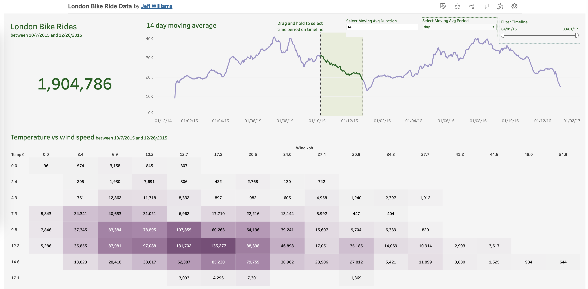

# London Bike Rides Analysis

## Overview
This project analyzes London's bike sharing data to uncover patterns in bike usage relative to weather conditions and temporal factors. The analysis combines Python data processing with Tableau visualization to create an interactive dashboard showing bike riding trends in London.

## Dataset
The dataset contains hourly bike rental data from London's bike sharing system, combined with weather information. Key features include:
- Timestamp of rental
- Count of bikes rented
- Temperature (real and "feels like")
- Humidity percentage
- Wind speed
- Weather conditions
- Holiday/weekend indicators
- Season information

## Tools Used
- **Python**: Data processing and preparation
  - Pandas: Data manipulation and analysis
  - Zipfile: File extraction
- **Tableau**: Data visualization and dashboard creation

## Project Structure
```
london-bike-rides/
│
├── data/
│   ├── london_merged.csv          # Raw data file
│   └── london_bikes_final.xlsx    # Processed data for Tableau
│
├── notebooks/
│   └── london_bikes_data.ipynb    # Data processing notebook
│
├── BikeDashboard.png             # Dashboard screenshot
└── README.md                     # Project documentation
```

## Data Processing
The data processing pipeline involves:
1. Loading the raw dataset using Pandas
2. Exploring and cleaning the data
3. Converting the processed data to Excel format for Tableau visualization

Key Python code snippets:
```python
import pandas as pd

# Read the dataset
bikes = pd.read_csv("london_merged.csv")

# Process and export to Excel
bikes.to_excel('london_bikes_final.xlsx', sheet_name='Data')
```

## Visualization
The Tableau dashboard provides interactive visualizations of:
- Moving average of bike rentals over time
- Temperature vs. wind speed impact on bike rentals
- Weather condition effects on riding patterns

You can view the interactive dashboard on [Tableau Public](https://public.tableau.com/app/profile/jeff.williams3778/viz/LondonBikeRideData_17399095478160/Dashboard).



## Key Findings
- The dataset spans from January 2015 to January 2017
- Over 1.9 million bike rides were recorded
- Clear weather patterns influence riding behavior
- Temperature and wind speed show significant correlation with ride frequency

## Getting Started
1. Clone this repository
2. Install required Python packages:
```bash
pip install pandas
pip install zipfile
```
3. Run the Jupyter notebook to process the data
4. Open the Excel file in Tableau to explore visualizations

## Future Improvements
- Add predictive modeling for bike demand
- Include more granular geographical data
- Analyze seasonal trends in more detail
- Incorporate additional weather variables

## Author
Jeff Williams
